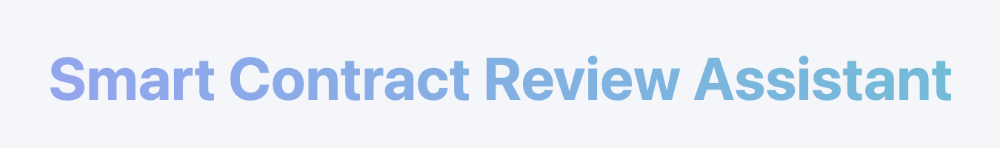
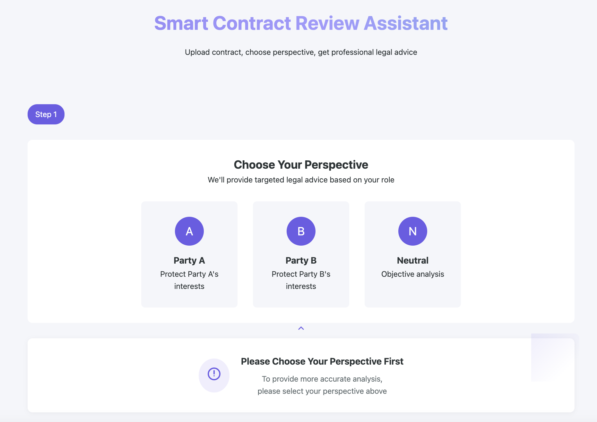

# Smart Contract Review Assistant



A professional web application that provides intelligent contract analysis from different perspectives using AI technology. This tool helps users analyze contracts from Party A's perspective, Party B's perspective, or a neutral standpoint.

## Features



- **Multi-Perspective Analysis**: Analyze contracts from three different viewpoints:
  - Party A (Principal/Initiator)
  - Party B (Contractor/Recipient)
  - Neutral (Balanced perspective)

- **Secure Authentication**:
  - User registration and login system
  - JWT-based authentication
  - Secure password hashing

- **Modern UI/UX**:
  - Intuitive drag-and-drop file upload
  - Responsive design
  - Real-time analysis feedback

- **Professional Analysis**:
  - Key risk point identification
  - Detailed clause analysis
  - Specific modification suggestions

## Technology Stack

- **Frontend**:
  - HTML5
  - CSS3
  - JavaScript (Vanilla)
  - Responsive Design

- **Backend**:
  - Node.js
  - Express.js
  - MongoDB
  - JWT Authentication

- **AI Integration**:
  - DeepSeek API
  - OpenAI API (configurable)

## Installation

1. Clone the repository:
git clone https://github.com/satashili/ailaw1.git
cd ailaw1-main

2. Install dependencies:
npm install

3. Set up environment variables:
Edit `.env` file and add your API keys and configuration

4. Start MongoDB service (make sure MongoDB is installed)

5. Run the application:
npm start

## Usage

1. Register/Login to access the system
2. Choose your perspective (Party A, Party B, or Neutral)
3. Upload your contract file (supported formats: TXT, DOC, DOCX, PDF)
4. Review the AI-generated analysis

## API Endpoints

### Authentication
- `POST /api/register` - User registration
- `POST /api/login` - User login

### Contract Analysis
- `POST /api/analyze` - Submit contract for analysis (requires authentication)

## Security

- Password hashing using bcrypt
- JWT-based authentication
- Input validation and sanitization
- Secure file upload handling
- Environment variable protection

## Project Structure
```
smart-contract-review/
├── index.html
├── upload.html
├── styles.css
├── upload.css
├── script.js
├── upload.js
├── server.js
├── .env
├── .env.example
├── .gitignore
└── README.md
```

## Future Enhancements

- Multi-language support
- Batch file processing
- Contract template suggestions
- Historical analysis tracking
- Export analysis reports
- Advanced user roles and permissions

## License

This project is licensed under the MIT License - see the [LICENSE](LICENSE) file for details.

## Acknowledgments

- DeepSeek API for AI capabilities
- MongoDB for database services
- Express.js community
- All contributors and users

## Contact

satoshili
Project Link: [https://github.com/satashili/ailaw1]

